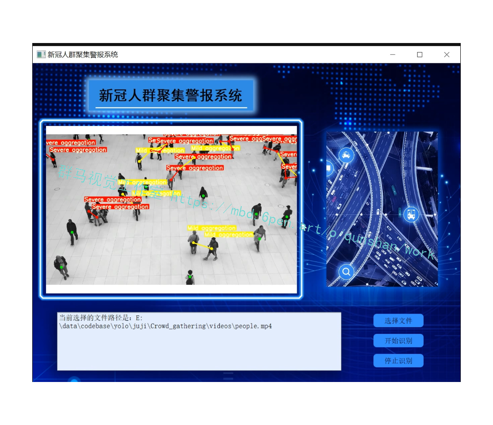
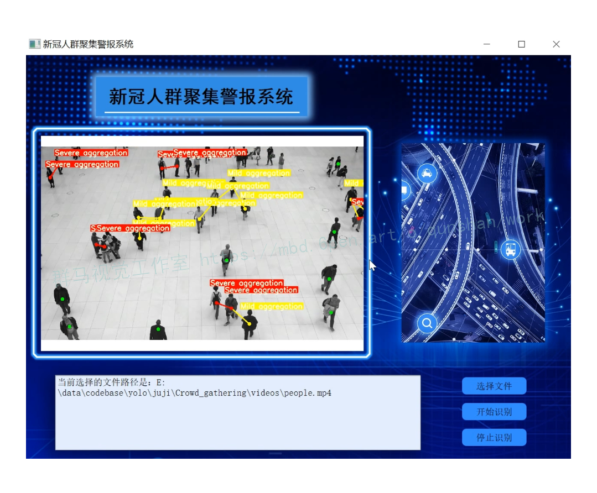
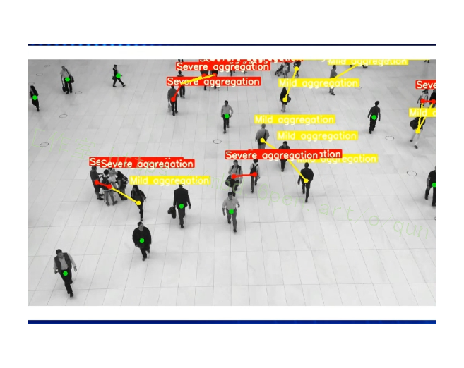
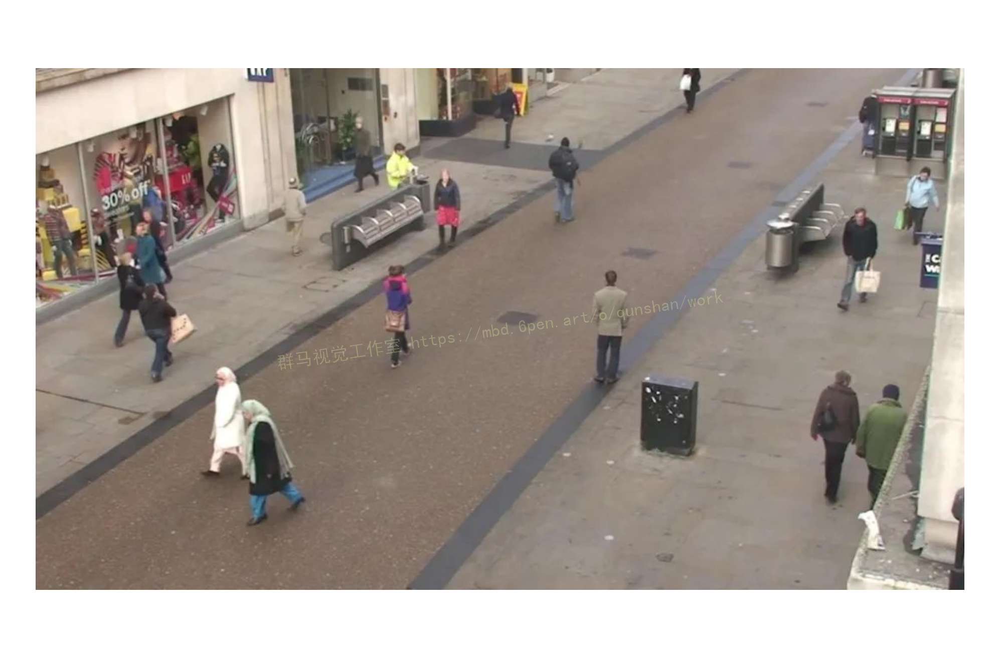
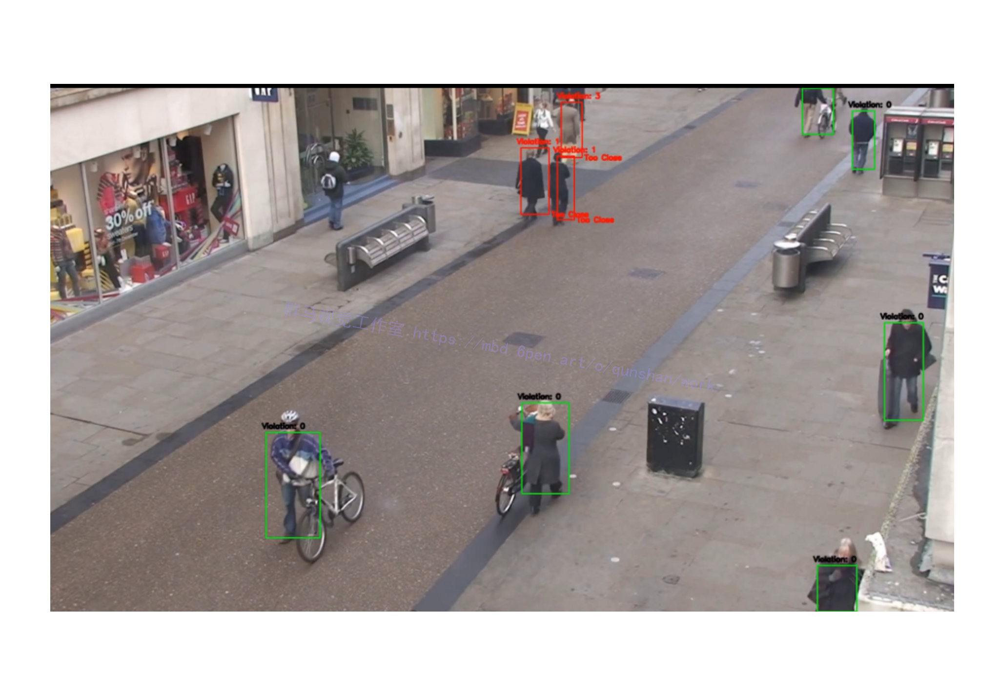
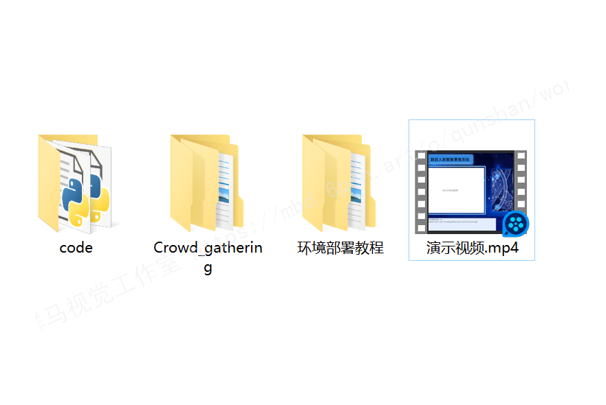



# 1.图片演示







# 2.视频演示
[[项目分享]Python基于OpenCV的实时疲劳检测[源码＆演示视频＆部署教程]_哔哩哔哩_bilibili](https://www.bilibili.com/video/BV1xP411V7Zg/?vd_source=bc9aec86d164b67a7004b996143742dc)

# 3.背景
美国和欧洲的许多城市现在都在谨慎地重新开放。人们被要求在外出时保持安全距离。但是人们照着做吗？城市对人们的安全距离是否符合规则进行评估并采取相应的行动是很重要的。如果大多数人都遵守疫情期间的命令，那么就可以安全地开放更多的公共场合。
然而，如果出现了太多违规行为，那么关闭这些场合可能更安全。
这正是迈阿密海滩公园发生的事。公园于四月底开放，但由于太多人藐视与戴口罩和社交安全距离有关的规定，公园在一周内就关闭了。该市通过警员监控公园并发出警告。但人类监测可能不是一个切实可行的解决办法。
我们如何使用人工智能和机器学习来检测人们是否遵循社交距离规则？大多数城市已经在公共场所安装了摄像头，这些摄像头正好可以用于此目的。
在这个博客中，我展示了如何使用行人跟踪算法来监控违规行为。

# 4.准备数据集
我们首先需要视频数据来构建和测试我们的模型。我使用了开放的[MOT数据集](https://afdian.net/item?plan_id=63a02c065f0811ed9c7652540025c377)（https://motchallenge.net/） 。

MOT数据集是计算机视觉行人跟踪的标准数据集。许多最先进的算法都是在该数据上训练和测试的。这个数据集有许多开源的剪辑片段显示在不同的相机角度下人的运动。我选择了一个固定高度的摄像机拍摄到的一个小片段，它的位置是在德国的城镇中心。

你可以从这里（http://www.robots.ox.ac.uk/ActiveVision/Research/Projects/2009bbenfold_headpose/project.html#datasets） 下载这个剪辑片段。请看下面这个剪辑片段中的一个帧。


# 5.使用深度排序进行行人跟踪
在计算机视觉中，行人跟踪是指给一个人一个ID，在他出现的每一帧中检测出他，并将他的ID转发出去；一旦他离开了这个ID，我们就不会重复使用他的ID；如果一个新的人进入，他就会被一个新的ID初始化。

跟踪往往是一项困难的任务，因为人们可能看起来很相似，导致模型切换ID。人们可能会被另一个人或物体挡住，当他们出现时会被分配一个新的ID。近年来，深度学习技术在多目标跟踪基准（https://motchallenge.net/results/MOT16/） 上的性能有了显著提高。目前多目标跟踪技术的精度是62.0

你可以在我的博客中阅读更多关于深度学习行人跟踪的内容。

https://towardsdatascience.com/people-tracking-using-deep-learning-5c90d43774be?gi=7af825362a53

为什么我们需要进行行人跟踪？

原因是我们想找出违反社会距离规则的人数量。在没有跟踪器的情况下，如果两个人走得很近，那么他们在每一帧中都会被视为违规，但是如果我们使用跟踪器，那么我们可以将其视为一次违规事件。

[参考这个博客，我使用了深度排序模型](https://mbd.pub/o/bread/Y5WTlJZs)（https://arxiv.org/abs/1703.07402） 进行跟踪。

这个模型的代码在作者的GitHub（https://github.com/nwojke/deep_sort） 上公开发布。

深度排序模型使用人的位置和外观来跟踪。位置信息通过Kalman滤波器捕获，Kalman滤波器预测盒子的下一个可能位置，而外观信息是使用生成嵌入的深度学习模型生成的。

若要在此视频上运行代码，需要将原始图像和包含所有边界框位置的检测文件传递给跟踪器；然后，跟踪器使用这些信息为每帧中的每个人分配一个ID。deep sort博客上详细解释了这一点。请参见下面对此剪辑执行跟踪的结果。正如你所看到的，每个人都被分配了一个ID，这个ID被成功地转入下一帧。跟踪器还输出一个csv，其中包含轨迹的详细信息。

我已经在Github上（https://github.com/priya-dwivedi/Deep-Learning/tree/master/detecting_social_distancing_violation） 共享了这个文件，我们将在代码的下一部分使用它。

使用深度排序模型进行行人跟踪：

现违反社交距离的行为

为了检测社会距离违规行为，我们在框架中选取每个轨道，并测量其与框架中其他轨道的距离。每个轨迹基本上都是一个带ID的边界框，因此可以使用它们之间的欧氏距离将边界框与另一个边界框进行比较。代码如下所示
```
def distance_boxes (boxA, boxB):
    import math
    center_boxA = [(boxA[0] + boxA[2])/ 2.0, (boxA[1] + boxA[3])/2.0]
    center_boxB = [(boxB[0] + boxB[2])/ 2.0, (boxB[1] + boxB[3])/2.0]
    pixel_distance  = math.sqrt( ((center_boxA[0]-center_boxB[0])**2)+((center_boxA[1]-center_boxB[1])**2) )
    return pixel_distance
 ```
对每个帧运行的主要步骤是：

比较每个轨迹和其他轨迹之间的像素距离

如果距离小于接近距离阈值，则两人距离太近。因此，将 safe=1 放在两个边界框的数据框中。变量“safe”稍后用于可视化

我们还计算每个ID的总违规次数。这是计算与它们太接近的其他ID。因此，只要距离小于接近距离阈值，我们都会在字典中维护一个过于接近的轨迹列表

代码运行得很慢，因为它需要将每个轨道与其他轨道进行比较，并在600帧以上执行此操作。这些计算中有许多是重复的，因为它将分别测量轨道1与轨道2之间的距离，然后测量轨道2与轨道1之间的距离。

为了节省时间，我将两次计算的结果存储在一次传递中。因此，当比较track1和track2时，结果将写入数据帧各自的行中，这样可以将运行时间减少一半。

我发现，像素距离为70对于检测那些“似乎”走得太近的人来说是相当合理的。代码的可视化模块会在框太近时亮显红色框，并显示每个框的违规计数。带有结果的示例框架如下所示。


# 6.代码实现
```
import argparse
import time
from pathlib import Path

import cv2
import torch
import torch.backends.cudnn as cudnn
from numpy import random

from models.experimental import attempt_load
from utils.datasets import LoadStreams, LoadImages
from utils.general import check_img_size, check_requirements, check_imshow, non_max_suppression, apply_classifier, \
    scale_coords, xyxy2xywh, strip_optimizer, set_logging, increment_path
from utils.plots import plot_one_box
from utils.torch_utils import select_device, load_classifier, time_synchronized, TracedModel


def detect(save_img=False):
    source, weights, view_img, save_txt, imgsz, trace = opt.source, opt.weights, opt.view_img, opt.save_txt, opt.img_size, not opt.no_trace
    save_img = not opt.nosave and not source.endswith('.txt')  # save inference images
    webcam = source.isnumeric() or source.endswith('.txt') or source.lower().startswith(
        ('rtsp://', 'rtmp://', 'http://', 'https://'))

    # Directories
    save_dir = Path(increment_path(Path(opt.project) / opt.name, exist_ok=opt.exist_ok))  # increment run
    (save_dir / 'labels' if save_txt else save_dir).mkdir(parents=True, exist_ok=True)  # make dir

    # Initialize
    set_logging()
    device = select_device(opt.device)
    half = device.type != 'cpu'  # half precision only supported on CUDA

    # Load model
    model = attempt_load(weights, map_location=device)  # load FP32 model
    stride = int(model.stride.max())  # model stride
    imgsz = check_img_size(imgsz, s=stride)  # check img_size

    if trace:
        model = TracedModel(model, device, opt.img_size)

    if half:
        model.half()  # to FP16

    # Second-stage classifier
    classify = False
    if classify:
        modelc = load_classifier(name='resnet101', n=2)  # initialize
        modelc.load_state_dict(torch.load('weights/resnet101.pt', map_location=device)['model']).to(device).eval()

    # Set Dataloader
    vid_path, vid_writer = None, None
    if webcam:
        view_img = check_imshow()
        cudnn.benchmark = True  # set True to speed up constant image size inference
        dataset = LoadStreams(source, img_size=imgsz, stride=stride)
    else:
        dataset = LoadImages(source, img_size=imgsz, stride=stride)

    # Get names and colors
    names = model.module.names if hasattr(model, 'module') else model.names
    colors = [[random.randint(0, 255) for _ in range(3)] for _ in names]

    # Run inference
    if device.type != 'cpu':
        model(torch.zeros(1, 3, imgsz, imgsz).to(device).type_as(next(model.parameters())))  # run once
    old_img_w = old_img_h = imgsz
    old_img_b = 1

    t0 = time.time()
    for path, img, im0s, vid_cap in dataset:
        img = torch.from_numpy(img).to(device)
        img = img.half() if half else img.float()  # uint8 to fp16/32
        img /= 255.0  # 0 - 255 to 0.0 - 1.0
        if img.ndimension() == 3:
            img = img.unsqueeze(0)

        # Warmup
        if device.type != 'cpu' and (old_img_b != img.shape[0] or old_img_h != img.shape[2] or old_img_w != img.shape[3]):
            old_img_b = img.shape[0]
            old_img_h = img.shape[2]
            old_img_w = img.shape[3]
            for i in range(3):
                model(img, augment=opt.augment)[0]

        # Inference
        t1 = time_synchronized()
        pred = model(img, augment=opt.augment)[0]
        t2 = time_synchronized()

        # Apply NMS
        pred = non_max_suppression(pred, opt.conf_thres, opt.iou_thres, classes=opt.classes, agnostic=opt.agnostic_nms)
        t3 = time_synchronized()

        # Apply Classifier
        if classify:
            pred = apply_classifier(pred, modelc, img, im0s)

        # Process detections
        for i, det in enumerate(pred):  # detections per image
            if webcam:  # batch_size >= 1
                p, s, im0, frame = path[i], '%g: ' % i, im0s[i].copy(), dataset.count
            else:
                p, s, im0, frame = path, '', im0s, getattr(dataset, 'frame', 0)

            p = Path(p)  # to Path
            save_path = str(save_dir / p.name)  # img.jpg
            txt_path = str(save_dir / 'labels' / p.stem) + ('' if dataset.mode == 'image' else f'_{frame}')  # img.txt
            gn = torch.tensor(im0.shape)[[1, 0, 1, 0]]  # normalization gain whwh
            if len(det):
                # Rescale boxes from img_size to im0 size
                det[:, :4] = scale_coords(img.shape[2:], det[:, :4], im0.shape).round()

                # Print results
                for c in det[:, -1].unique():
                    n = (det[:, -1] == c).sum()  # detections per class
                    s += f"{n} {names[int(c)]}{'s' * (n > 1)}, "  # add to string

                # Write results
                for *xyxy, conf, cls in reversed(det):
                    if save_txt:  # Write to file
                        xywh = (xyxy2xywh(torch.tensor(xyxy).view(1, 4)) / gn).view(-1).tolist()  # normalized xywh
                        line = (cls, *xywh, conf) if opt.save_conf else (cls, *xywh)  # label format
                        with open(txt_path + '.txt', 'a') as f:
                            f.write(('%g ' * len(line)).rstrip() % line + '\n')

                    if save_img or view_img:  # Add bbox to image
                        label = f'{names[int(cls)]} {conf:.2f}'
                        plot_one_box(xyxy, im0, label=label, color=colors[int(cls)], line_thickness=1)

            # Print time (inference + NMS)
            print(f'{s}Done. ({(1E3 * (t2 - t1)):.1f}ms) Inference, ({(1E3 * (t3 - t2)):.1f}ms) NMS')

            # Stream results
            if view_img:
                cv2.imshow(str(p), im0)
                cv2.waitKey(1)  # 1 millisecond

            # Save results (image with detections)
            if save_img:
                if dataset.mode == 'image':
                    cv2.imwrite(save_path, im0)
                    print(f" The image with the result is saved in: {save_path}")
                else:  # 'video' or 'stream'
                    if vid_path != save_path:  # new video
                        vid_path = save_path
                        if isinstance(vid_writer, cv2.VideoWriter):
                            vid_writer.release()  # release previous video writer
                        if vid_cap:  # video
                            fps = vid_cap.get(cv2.CAP_PROP_FPS)
                            w = int(vid_cap.get(cv2.CAP_PROP_FRAME_WIDTH))
                            h = int(vid_cap.get(cv2.CAP_PROP_FRAME_HEIGHT))
                        else:  # stream
                            fps, w, h = 30, im0.shape[1], im0.shape[0]
                            save_path += '.mp4'
                        vid_writer = cv2.VideoWriter(save_path, cv2.VideoWriter_fourcc(*'mp4v'), fps, (w, h))
                    vid_writer.write(im0)

    if save_txt or save_img:
        s = f"\n{len(list(save_dir.glob('labels/*.txt')))} labels saved to {save_dir / 'labels'}" if save_txt else ''
        #print(f"Results saved to {save_dir}{s}")

    print(f'Done. ({time.time() - t0:.3f}s)')


if __name__ == '__main__':
    parser = argparse.ArgumentParser()
    parser.add_argument('--weights', nargs='+', type=str, default='yolov7.pt', help='model.pt path(s)')
    parser.add_argument('--source', type=str, default='inference/images', help='source')  # file/folder, 0 for webcam
    parser.add_argument('--img-size', type=int, default=640, help='inference size (pixels)')
    parser.add_argument('--conf-thres', type=float, default=0.25, help='object confidence threshold')
    parser.add_argument('--iou-thres', type=float, default=0.45, help='IOU threshold for NMS')
    parser.add_argument('--device', default='', help='cuda device, i.e. 0 or 0,1,2,3 or cpu')
    parser.add_argument('--view-img', action='store_true', help='display results')
    parser.add_argument('--save-txt', action='store_true', help='save results to *.txt')
    parser.add_argument('--save-conf', action='store_true', help='save confidences in --save-txt labels')
    parser.add_argument('--nosave', action='store_true', help='do not save images/videos')
    parser.add_argument('--classes', nargs='+', type=int, help='filter by class: --class 0, or --class 0 2 3')
    parser.add_argument('--agnostic-nms', action='store_true', help='class-agnostic NMS')
    parser.add_argument('--augment', action='store_true', help='augmented inference')
    parser.add_argument('--update', action='store_true', help='update all models')
    parser.add_argument('--project', default='runs/detect', help='save results to project/name')
    parser.add_argument('--name', default='exp', help='save results to project/name')
    parser.add_argument('--exist-ok', action='store_true', help='existing project/name ok, do not increment')
    parser.add_argument('--no-trace', action='store_true', help='don`t trace model')
    opt = parser.parse_args()
    print(opt)
    #check_requirements(exclude=('pycocotools', 'thop'))

    with torch.no_grad():
        if opt.update:  # update all models (to fix SourceChangeWarning)
            for opt.weights in ['yolov7.pt']:
                detect()
                strip_optimizer(opt.weights)
        else:
            detect()
```
# 7.社交距离检测＆系统整合
跟踪是计算机视觉中的一个重要问题，有着广泛的应用，其中一个应用程序就是检测社交距离违规行为，这可以帮助城市评估公共卫生风险，并在较安全的情况下重新开放公共场合。

下图[完整源码＆环境部署视频教程＆自定义UI界面](https://s.xiaocichang.com/s/1e9c37)


参考博客[《\[智慧防疫\]Python基于YOLO的新冠社交距离检测系统\[完整源码＆部署教程\]》](https://mbd.pub/o/qunma/work)


# 8.参考文献：
***
*   *[1]*[面向重大公共卫生事件的位置服务技术——以COVID-19疫情为例](https://kns.cnki.net/kcms/detail/detail.aspx?filename=WHCH202102002&dbcode=CJFQ&dbname=DKFX2021&v=kv866gsLbeP16uq5ZRo2eCB1iEWrmFwWbkXhFZNtHxI1D1cLQNAJr-BCvy3h3ajd)[J]. 郭迟,王梦媛,高柯夫,刘经南,左文炜.  武汉大学学报(信息科学版). 2021(02)
*   *[2]*[基于中文分词的加权地理编码在COVID-19疫情防控空间定位中的应用](https://kns.cnki.net/kcms/detail/detail.aspx?filename=WHCH202006003&dbcode=CJFQ&dbname=DKFX2020&v=F8VFDZDxdDUbKfDPh1P5y8ltV9gqLsn1bBvsba0CzOPAeOSivM0bIhsYYMxfnj1e)[J]. 彭明军,李宗华,刘辉,孟成,李勇.  武汉大学学报(信息科学版). 2020(06)
*   *[3]*[考虑认知的耦合网络中信息感知对传染病控制的作用——以COVID-19在中国的传播为例](https://kns.cnki.net/kcms/detail/detail.aspx?filename=XUXI20220715000&dbcode=CJFQ&dbname=DKFX2022&v=hF7Q-oHNw7qa4e7Sgn5NYMV-H9Kqt0232hjC9qPcgsDiUaAMYUialUNkIoZBm2Df)[J]. 郭春香,张殷杰.  软科学.
*   *[4]*[基于环比增长率和空间约束聚类算法分析中国COVID-19疫情的风险现状](https://kns.cnki.net/kcms/detail/detail.aspx?filename=JBKZ202005012&dbcode=CJFQ&dbname=DKFX2020&v=fsWgVwn8MYnvqEurZCoFZK1q38WwmozSz451rfTweggm90VgoFUCL-WYpK3LUC8F)[J]. 胡健,张俊,王文舸,董琳娟,黄家祺,张志杰.  中华疾病控制杂志. 2020(05)
*   *[5]*[中国人口流动管控应对COVID-19疫情效应评估](https://kns.cnki.net/kcms/detail/detail.aspx?filename=DLXB202202011&dbcode=CJFQ&dbname=DKFX2022&v=O-KtyIQOMeo2oLp1EH2XahGrToon5Tw8Plo3QwCMwGv6hf1VIEe3rCanSbuGfVo7)[J]. 赵梓渝,韩钟辉,魏冶,王士君.  地理学报. 2022(02)
*   *[6]*[COVID-19疫情暴发后中国成人创伤后应激障碍流行及弱势群体](https://kns.cnki.net/kcms/detail/detail.aspx?filename=JBKZ202206015&dbcode=CJFQ&dbname=DKFX2022&v=HtvsBXGd8GgDqQB-oBnq8LqS3QrIAu1mQMTFO24zlvgGHL-DVrjCwuOkuXdbawKo)[J]. 王卫东,胡以松.  中华疾病控制杂志. 2022(06)
*   *[7]*[以COVID-19科研论文为课堂设计主线在免疫学线上教学中的应用](https://kns.cnki.net/kcms/detail/detail.aspx?filename=XBFM202012016&dbcode=CJFQ&dbname=CJFD2020&v=EbarEU5HKG5dCEVlToKDHdb-ZktZIsf-fStMfWH97ZZjhAgmRFYJGzWFC5TGC5fg)[J]. 马樱,张宇丝,张春梅,唐康,王微,张瑞,庄然,张赟.  细胞与分子免疫学杂志. 2020(12)
*   *[8]*[COVID-19疫情初期某医学院大学生口罩使用行为现况调查](https://kns.cnki.net/kcms/detail/detail.aspx?filename=YYCD202101014&dbcode=CJFQ&dbname=CJFD2021&v=9OY4te7cn-mca2v0PLJeY7k7gpnOTBU5rQzVzpCEQ7fqEo-kdXTfXdrTqtX8L2M2)[J]. 冯曦兮,刘珂,唐景霞,张敏,黄小倩,石雪梅,张涵,杨书,任宇.  现代临床医学. 2021(01)
*   *[9]*[COVID-19数据可视化及预测分析](https://kns.cnki.net/kcms/detail/detail.aspx?filename=XDXK202019002&dbcode=CJFQ&dbname=CJFD2020&v=tejSGq6MMACZgd2ivreZqQbT-MfRmFfOB0MBNl5uKR9uYokEHj20a_lMMfQzM0d4)[J]. 大学生创新创业课题组.  现代信息科技. 2020(19)
*   *[10]*[四川省COVID-19密切接触者转确诊病例流行病学分析](https://kns.cnki.net/kcms/detail/detail.aspx?filename=YFYX202102003&dbcode=CJFQ&dbname=DKFX2021&v=4CHHJ3rDT5zHaNJB2ChM4pEn9fBk8l0DKaqY2pGDYO9ojDqDeSzDaMXZzl-hLORE)[J]. 周玉锦,邱乐平,苏茜,吴玺,袁珩,毛素玲.  预防医学情报杂志. 2021(02)


---
#### 如果您需要更详细的【源码和环境部署教程】，除了通过【系统整合】小节的链接获取之外，还可以通过邮箱以下途径获取:
#### 1.请先在GitHub上为该项目点赞（Star），编辑一封邮件，附上点赞的截图、项目的中文描述概述（About）以及您的用途需求，发送到我们的邮箱
#### sharecode@yeah.net
#### 2.我们收到邮件后会定期根据邮件的接收顺序将【完整源码和环境部署教程】发送到您的邮箱。
#### 【免责声明】本文来源于用户投稿，如果侵犯任何第三方的合法权益，可通过邮箱联系删除。